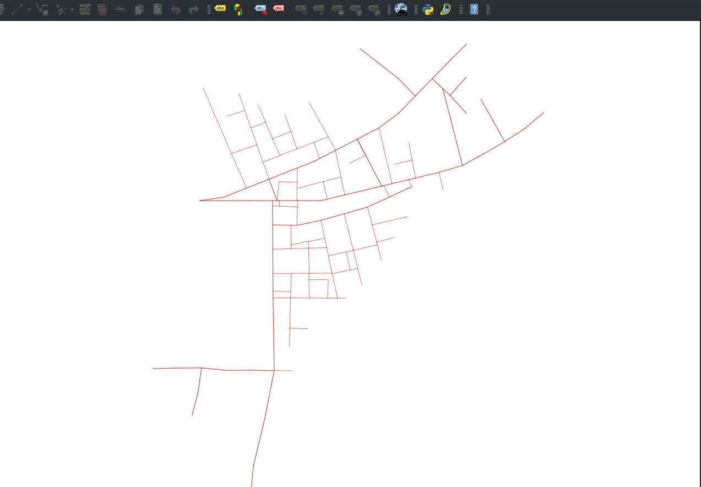

## Citygen_rs

Forked from [CityGen](https://github.com/t-mw/citygen) which was originally written in CoffeeScript.

Unlike the original one, this repo only generates the roads, and not the buildings.

Run `cargo run` in the repo and it will generate the roads in [GeoJSON](https://geojson.org/) format. And then you can render it with Mapbox or QGIS, for example.

